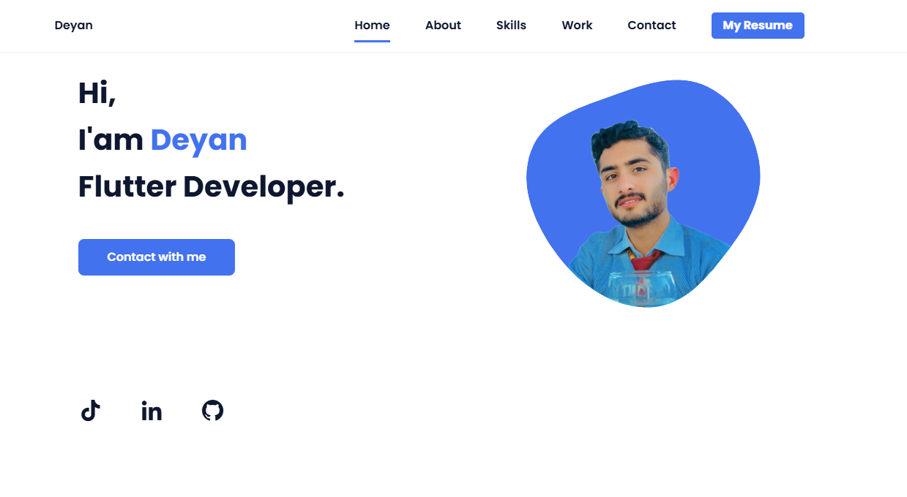
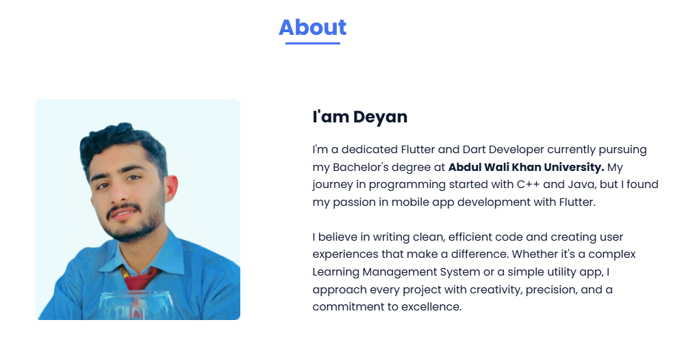
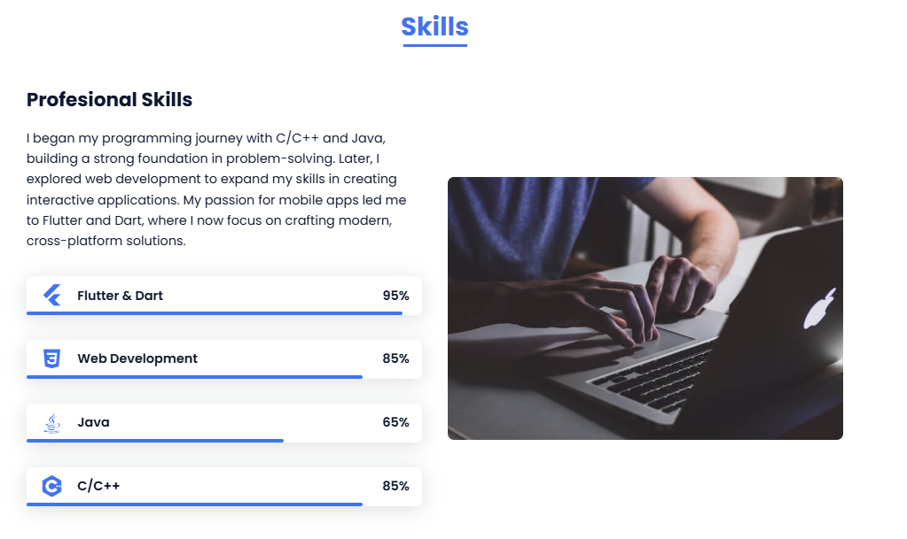
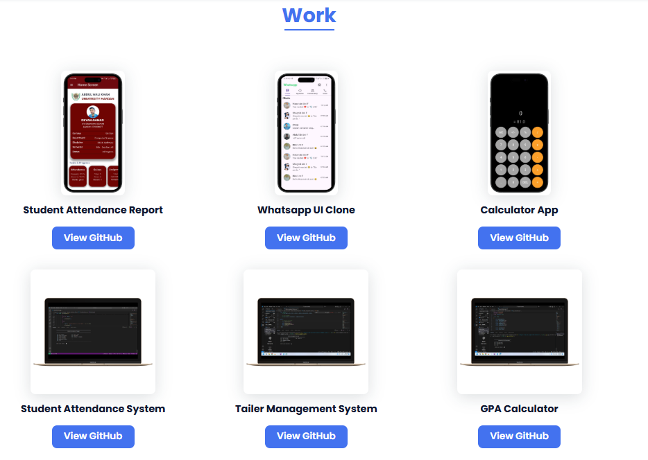

# Portfolio Responsive Complete

## Features

- **Modern Design:** Clean and visually appealing layout with a focus on usability.
- **Fully Responsive:** Adapts seamlessly to mobile, tablet, and desktop screens.
- **Animated Elements:** Engaging animations triggered on scroll for a dynamic user experience.
- **Smooth Navigation:** Easy navigation with smooth scrolling between sections.
- **Mobile First:** Designed with mobile users in mind, then enhanced for larger screens.
- **Cross-Browser Compatibility:** Works consistently across all major browsers.
- **Easy Customization:** Well-structured codebase for effortless updates and personalization.

## Website Screenshots

Below are some screenshots showcasing different sections of the portfolio website:

<!--  -->

